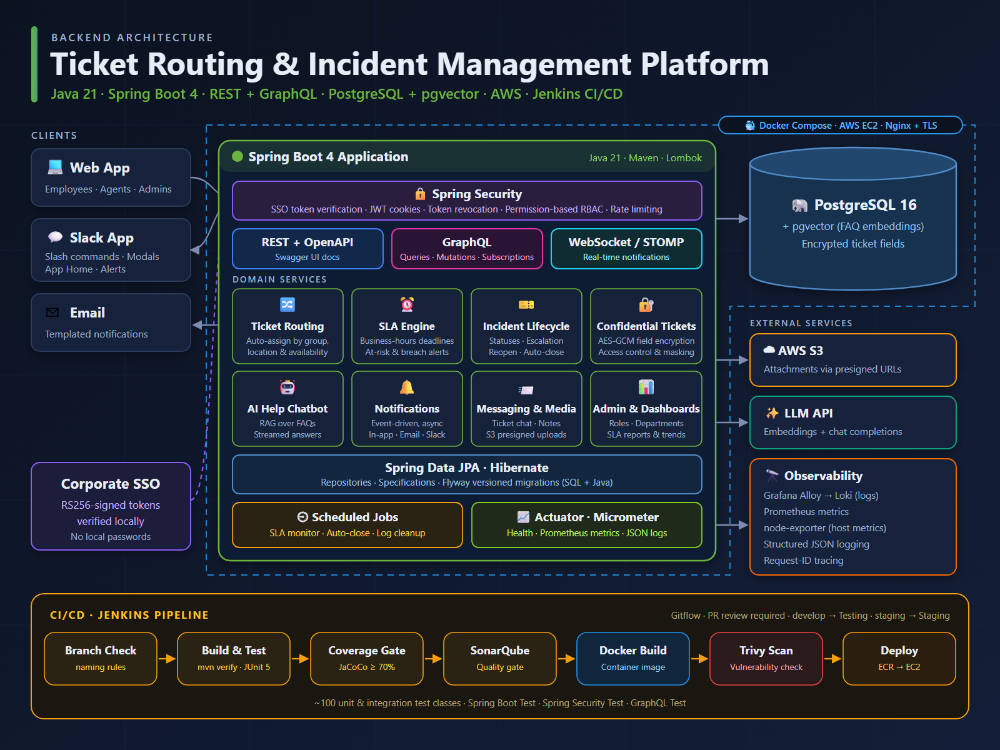

# Ticket Routing & Incident Management Platform

An enterprise incident-management backend where employees submit support tickets
(via web or Slack) and the system routes them to the right agent automatically.

WHAT IT DOES
• Smart routing: auto-assigns tickets by agent group, location, and agent availability
• SLA engine: business-hours deadlines per severity, with at-risk and breach alerts
• Full ticket lifecycle: statuses, escalation, reassignment, reopen, and auto-close
• Confidential tickets: AES-GCM field-level encryption, access control, and masking
• AI help chatbot: answers FAQs using RAG (pgvector embeddings + LLM), streamed live
• Notifications: event-driven and async, delivered in-app, by email, and in Slack
• Ticket chat, internal notes, and file attachments via S3 presigned URLs
• Admin tools: roles and permissions, departments, dashboards, and SLA reports

HOW IT'S BUILT
• Java 21, Spring Boot 4, Spring Security, Spring Data JPA / Hibernate
• REST (OpenAPI/Swagger) + GraphQL (queries, mutations, subscriptions) + WebSocket/STOMP
• SSO with RS256 token verification, JWT cookies, token revocation, rate limiting
• PostgreSQL 16 + pgvector, schema managed with Flyway migrations
• Docker Compose on AWS EC2 behind Nginx with TLS
• Observability: Actuator, Micrometer/Prometheus, Grafana Alloy → Loki, JSON logs

QUALITY & DELIVERY
• ~100 unit and integration test classes (JUnit 5, Spring Boot Test)
• Jenkins pipeline: build → tests → JaCoCo 70% gate → SonarQube → Docker → Trivy scan → ECR → EC2
• Gitflow with mandatory pull-request review

